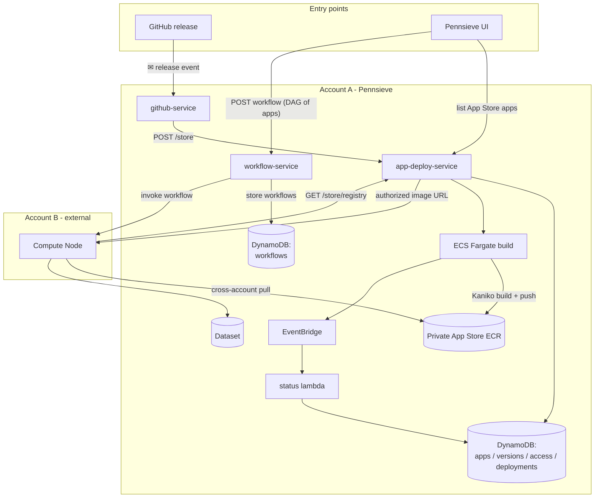

# AppStore Architecture

End-to-end flow: how the **github-service** invokes the **app-deploy-service**
to build and register an application from a GitHub release, how the
**workflow-service** composes workflows from those App Store app references, and
how a workflow is run on an external **compute node** in a separate AWS account.

All Pennsieve services run in **Account A**; only the **compute node** that
executes the workflow lives in the external **Account B**.

</content>
